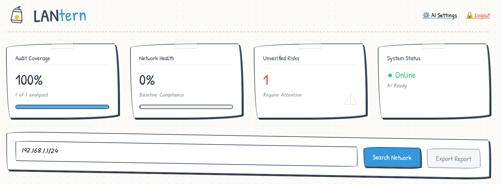

<p align="center">
  
</p>

# LANtern - Enterprise Network Auditor

A professional-grade network scanning and security auditing tool. LANtern combines deep Nmap port discovery with real-time risk assessment and AI-powered security analysis.

## 🚀 Key Features

- **Dynamic Executive Dashboard:** 
    - **Audit Coverage:** Track exactly how many discovered hosts have been scanned.
    - **Network Health:** A real-time score that reflects your compliance with a verified baseline.
    - **Unverified Risks:** Instantly see how many active services still require administrative review.
- **Smart Discovery & Port Scanning:**
    - **CIDR Range Sweeps:** Fast host discovery with automatic MAC vendor identification.
    - **Risk-Weighted Scanning:** Common ports are automatically assigned severity scores (1-10) to prioritize high-risk exposures.
    - **Baseline Tracking:** Compares current scans against history to highlight "New" or "Removed" services.
- **AI-Powered Security Audit:**
    - **LM Studio Integration:** Connect to local LLMs (like Qwen2.5 or Llama3) for professional security summaries.
    - **Model Management:** Automatic detection and selection of loaded models via LM Studio's API.
    - **Risk-Aware Analysis:** The AI uses backend severity weights to prioritize findings in its executive reports.
- **Persistent Configuration:**
    - Automatically saves your last-used CIDR range, AI endpoint, and selected model to `config.json`.
    - No re-entry required between server restarts.
- **Secure Access:**
    - Single administrative password authentication
    - HTTPS encryption for secure access over the network

## 🛠 Installation

### 1. Prerequisites

```bash
# Debian/Ubuntu
sudo apt-get update
sudo apt-get install -y nmap python3-venv openssl net-tools

# macOS
brew install nmap
```

### 2. Setup Virtual Environment & Install Dependencies

```bash
# On the server - create a NEW virtual environment
cd /home/user/scanner
python3 -m venv venv

# Install dependencies
./venv/bin/pip install -r requirements.txt
```

**Note:** The `config.json` file will be created automatically when you first run the scanner. You'll set up your admin password through the web interface.

### 3. Generate SSL Certificates

The application requires SSL certificates to run with HTTPS. Generate a self-signed certificate (or use your own):

```bash
openssl req -x509 -newkey rsa:4096 -keyout key.pem -out cert.pem -days 365 -nodes -subj "/CN=scanner"
```

For production use with a proper domain, use Let's Encrypt or your own CA.

## 🚦 Running the Application

### Development/Testing

The scanner requires `sudo` (or root) privileges to perform raw socket operations for Nmap's version detection and ARP lookups.

```bash
cd /path/to/scanner
sudo ./venv/bin/python scanner.py
```

Access the dashboard at: **https://localhost:8765** (edit `scanner.py` line 1 and the `uvicorn.run()` call at the end to change port)

### Production Deployment

#### Option 1: Direct Run (Simple)

```bash
cd /path/to/scanner
sudo ./venv/bin/python scanner.py
```

The app runs on `0.0.0.0:8765` with HTTPS enabled. Access via `https://your-server-ip:8765`.

> **Note:** To use a different port (e.g., 443), edit `scanner.py`: update the comment on line 1 and the `port` parameter in the `uvicorn.run()` call at the end of the file.

#### Option 2: Systemd Service (Recommended)

Create a service file at `/etc/systemd/system/lantern.service`:

```ini
[Unit]
Description=LANtern Service
After=network.target

[Service]
Type=simple
User=root
WorkingDirectory=/path/to/scanner
ExecStart=/path/to/scanner/venv/bin/python /path/to/scanner/scanner.py
Restart=always
RestartSec=10

[Install]
WantedBy=multi-user.target
```

Then enable and start:

```bash
sudo systemctl daemon-reload
sudo systemctl enable lantern
sudo systemctl start lantern
```

Check status:
```bash
sudo systemctl status lantern
```

## 🔐 Initial Setup

1. Open the dashboard in your browser: `https://your-server-ip:8765` (port can be changed in `scanner.py`)
2. You'll see a setup screen - create your administrative password
3. This password is stored securely using bcrypt hashing
4. Use the **Logout** button to end your session

### Password Reset

If you lose your password, reset it via the CLI:

```bash
cd /path/to/scanner
sudo ./venv/bin/python reset_password.py
```

You'll be prompted to enter and confirm your new password.

## 🤖 AI Setup (Optional)

1. Launch **LM Studio** on a machine that can access your scanner network
2. Go to the **Local Server** tab in LM Studio
3. Load your desired model
4. In LANtern, click **⚙️ AI Settings**
5. Enter your LM Studio endpoint (e.g., `http://192.168.1.50:1234`)
6. Click the refresh button to load available models
7. Select your model and click **Save**

## 📊 Dashboard Metrics

| Metric | Description |
|--------|-------------|
| **Audit Coverage** | Percentage of discovered hosts that have been port scanned (based on historical data). |
| **Network Health** | Score based on how many open ports have been "Confirmed OK" by an admin. |
| **Unverified Risks** | Count of open ports that haven't been reviewed yet. |
| **System Status** | Real-time connectivity check for the backend and AI engine. |

## 💾 Persistent Data

Scan history is stored persistently in `scan_history.json`:
- Host data (IP, MAC, hostname, vendor) persists across sessions
- Port scan results and "confirmed OK" status are remembered
- "Last Scanned" timestamp shown for each host
- If a host goes offline, it won't appear in the list until it's rediscovered

## 🛠 Tech Stack

- **Backend:** Python 3.13+, FastAPI, Nmap (via python-nmap)
- **Frontend:** Vanilla JavaScript (ES6+), CSS3 (Modern Grid/Flexbox), HTML5
- **AI Integration:** LM Studio (OpenAI-Compatible API)
- **Persistence:** JSON-based history and configuration
- **Security:** bcrypt password hashing, HTTPS/SSL

## ⚠️ Security Note

LANtern uses self-signed SSL certificates by default. When accessing the dashboard:
- Your browser will show a security warning (expected for self-signed certs)
- For production, replace with a certificate from a trusted CA (Let's Encrypt, etc.)
- Or proceed past the warning to access the dashboard
